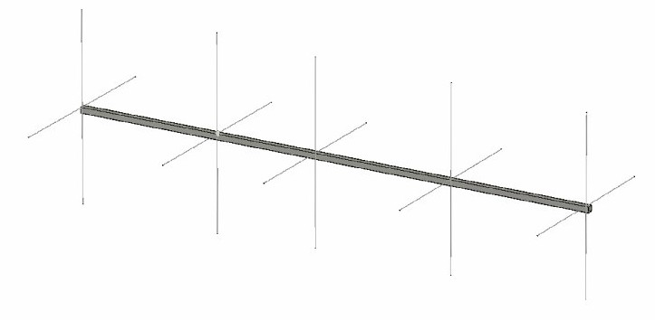
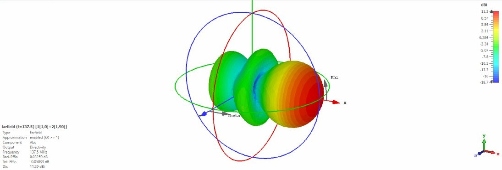
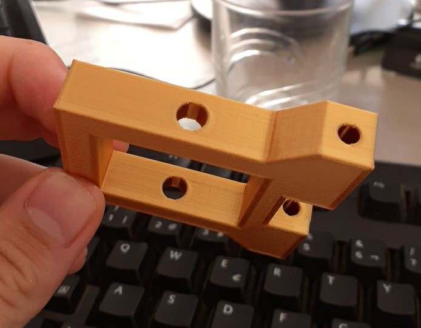

# Yagi-137

Yagi antenna for APT and LRPT reception

## Antenna specifications

|      **PARAMETER**     |    **VALUE**   |         **OTHERS**         |
|:----------------------:|:--------------:|:--------------------------:|
|      **Frequency**     | 136,15 - 138,5 |             MHz            |
|    **Polarization**    |      RHCP      |                            |
|        **VSWR**        |       1,2      |         @ 137,6MHz         |
|     **Directivity**    |      11,3      |             dBi            |
| **Antenna efficiency** |      0,987     | @ 137,6MHz                 |
|         **SLL**        |      -12,8     |             dB             |
|      **F/B Ratio**     |      17,2      |             dB             |
|         **XPD**        |      33,7      | dB; @ 137,6MHz; theta = 0º |
|  **Nominal Impedance** |       50       |             Ohm            |

## Design

|         **MEASURE**         | **VALUE (mm)** |
|:---------------------------:|:--------------:|
|     **Reflector length**    |       992      |
|      **Dipole length**      |      1023      |
|    **Director 1 length**    |       970      |
|    **Director 2 length**    |       973      |
|    **Director 3 length**    |       940      |
|   **Reflector placement**   |      -751      |
|     **Dipole placement**    |        0       |
|   **Director 1 placement**  |       541      |
|   **Director 2 placement**  |      1280      |
|   **Director 3 placement**  |      2012      |
| **Total length of antenna** |      2763      |

## Results

See the *results* folder for images with the results of the corresponding simulations

## 3D printable parts

For fastening the yagi elements to the main boom, we have designed the following T-shaped, 3D printable pieces: 

You can find both the FreeCAD souce files and the .stl printable files in the *3D* folder